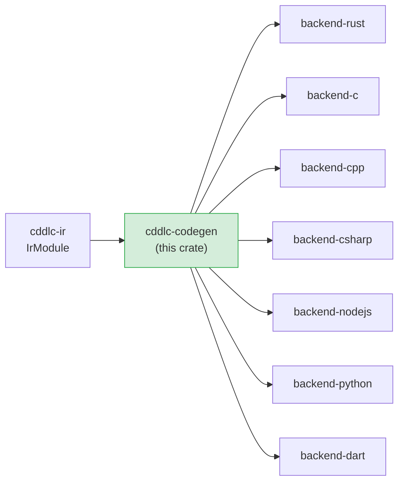

# cddlc-codegen

Defines the `Backend` trait that all language backends must implement, and provides shared
emit utilities (name-mangling helpers, primitive type maps, constraint-check generators,
and the `IndentWriter` string builder) used by every backend crate.

## Position in the pipeline



## The Backend trait

```rust
pub trait Backend {
    fn generate(
        &self,
        module: &IrModule,
        opts:   &CodegenOptions,
    ) -> Result<CodegenOutput, CodegenError>;
}
```

A `CodegenOutput` is simply a list of named in-memory files:

```rust
pub struct CodegenOutput {
    pub files: Vec<CodegenFile>,
}

pub struct CodegenFile {
    pub path:    PathBuf,   // relative path inside the output directory
    pub content: String,    // complete text of the file
}
```

The CLI collects these files and writes them to disk; the backend never touches the
filesystem.

## CodegenOptions

All user-facing flags are forwarded to the backend via a single options struct:

```rust
pub struct CodegenOptions {
    pub lang:        Language,   // target language enum
    pub format:      Format,     // Cbor | Json
    pub runtime:     String,     // minicbor / tinycbor / …
    pub alloc:       AllocStrat, // Stack | Arena | Heap
    pub dcbor:       bool,       // deterministic CBOR encoding
    pub no_std:      bool,       // Rust only — #![no_std]
    pub depth_limit: u32,        // max decoder nesting depth
    pub namespace:   Option<String>,
    pub max_array:   u32,        // default capacity for [* T]
    pub max_str:     u32,        // default capacity for tstr
}

pub enum Language { Rust, C, Cpp, CSharp, NodeJs, Python, Dart }
pub enum Format   { Cbor, Json }
pub enum AllocStrat { Stack, Arena, Heap }
```

## Shared emit utilities (`emit` module)

All backends import from `cddlc_codegen::emit`:

### IndentWriter

A simple string builder that tracks an indentation level.  All backends use it to produce
correctly indented source code without manual string concatenation:

```rust
let mut w = IndentWriter::new("    "); // 4-space indent
w.line("fn encode(&self) {");
w.indent();
w.line("let x = 1;");
w.dedent();
w.line("}");
let source = w.finish();
```

### Name-mangling helpers

| Function | Transforms to |
|---|---|
| `to_snake_case(s)` | `snake_case` (Rust fields, Python attrs, C identifiers) |
| `to_pascal_case(s)` | `PascalCase` (Rust/C#/Dart type names) |
| `to_screaming_snake(s)` | `SCREAMING_SNAKE` (C enum constants) |
| `to_lower_camel_case(s)` | `lowerCamelCase` (TypeScript/Dart fields) |

### Primitive type maps

| Function | Returns |
|---|---|
| `primitive_to_rust(p)` | `"u64"`, `"i64"`, `"f32"`, `"bool"`, `"String"`, … |
| `primitive_to_c(p)` | `"uint64_t"`, `"int64_t"`, `"float"`, `"bool"`, … |
| `primitive_to_csharp(p)` | `"ulong"`, `"long"`, `"float"`, `"bool"`, `"string"`, … |
| `primitive_to_ts(p)` | `"number"`, `"boolean"`, `"string"`, … |
| `primitive_to_python(p)` | `"int"`, `"float"`, `"bool"`, `"str"`, `"bytes"`, … |
| `primitive_to_dart(p)` | `"int"`, `"double"`, `"bool"`, `"String"`, `"Uint8List"`, … |

### Constraint-check generators

| Function | Returns a source-code string |
|---|---|
| `constraint_to_rust_check(c, ident)` | `assert!(ident.len() <= N, …)` |
| `constraint_to_c_check(c, ident)` | `assert(strlen(ident) <= N)` |
| `capacity_value(pragmas, default)` | Reads `@capacity` pragma or falls back to `default` |

### Literal helpers

| Function | Purpose |
|---|---|
| `literal_to_rust(v)` | `42u64`, `"hello"`, `true` |
| `literal_to_c(v)` | `42ULL`, `"hello"`, `1` |

## Adding a new backend

1. Create a new crate (e.g. `backend-java`).
2. Add `cddlc-ir` and `cddlc-codegen` as dependencies.
3. Implement the `Backend` trait:
   ```rust
   use cddlc_codegen::{Backend, CodegenOptions, CodegenOutput, CodegenError};
   use cddlc_ir::IrModule;

   pub struct JavaBackend;
   impl Backend for JavaBackend {
       fn generate(&self, module: &IrModule, opts: &CodegenOptions)
           -> Result<CodegenOutput, CodegenError> { … }
   }
   ```
4. Wire it into `cddlc-cli`: add a `Lang::Java` variant, import the crate, add a match arm.
5. Optionally add a harness to `backend-interop` and `backend-buildtest`.

## Known gaps and future enhancements

- **No `async` streaming codegen** — all output is buffered in memory before being returned.
  For very large schemas this could be memory-intensive.
- **No cross-backend shared test utilities** — each backend re-implements its own test
  scaffolding helpers; a shared `test_utils` module would reduce duplication.
- **`@doc` rendering** — the emit module preserves doc-pragma text in the IR but does not
  provide a shared helper for generating language-native doc comments; each backend must
  implement its own.
- **`CodegenError` is opaque** — it is currently a plain string; typed error variants would
  make it easier for callers to handle specific failure modes.

## License

MIT OR Apache-2.0
